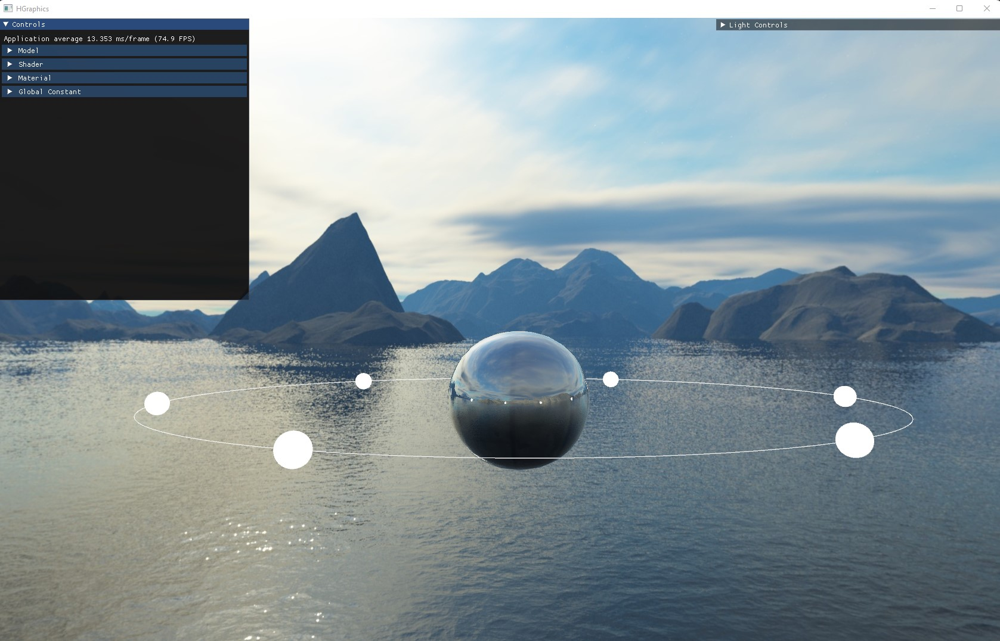
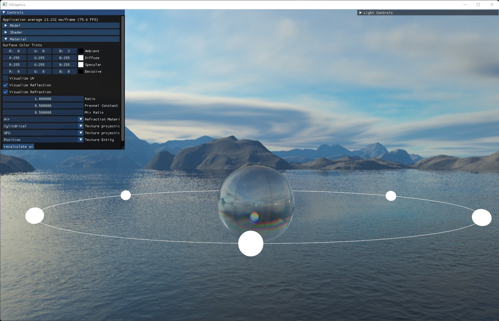

# HGraphics

How to build:
* Run `RunCMake.bat` file.
* Launch `.sln` file on `build_MSVC` dir.

3D Graphics Framework:

* Made with OpenGL 4.5 and C++
* Created custom data pipeline for model, shader, and texture loading
* Implemented custom UV mapping & normal calculation.
* Implemented blinn/phong shading model with multiple light effects
* Implemented deferred shading 
* Supports fully functioning GUI features with ImGui