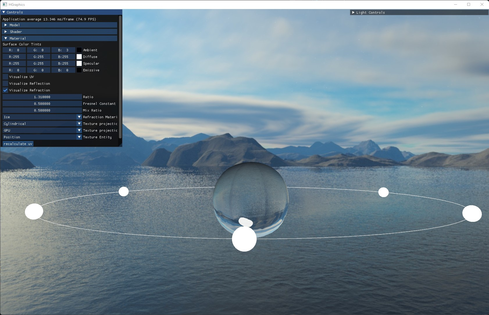
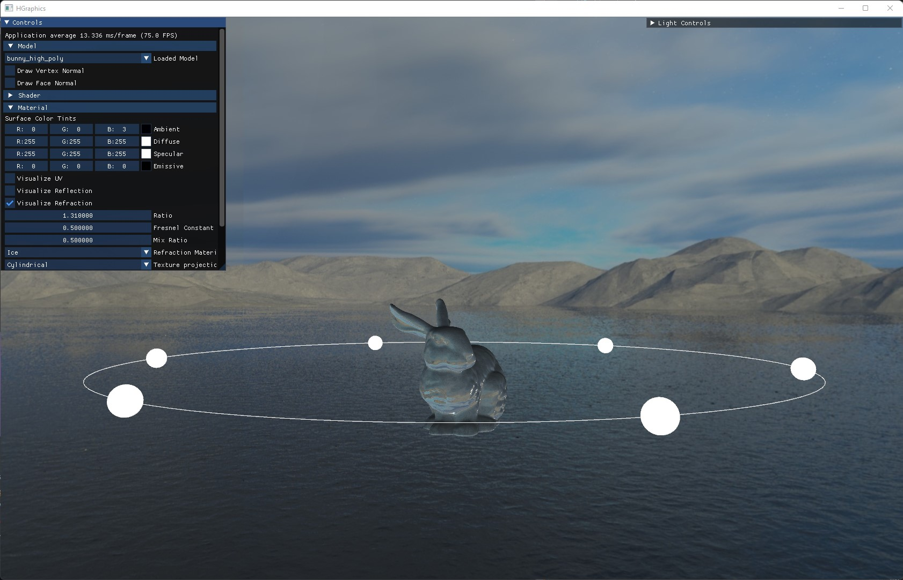

# HGraphics

3D Graphics Framework:

* Made with OpenGL 4.5 and C++
* Created custom data pipeline for model, shader, and texture loading
* Implemented custom UV mapping & normal calculation.
* Implemented blinn/phong shading model with multiple light effects
* Supports fully functioning GUI features with ImGui